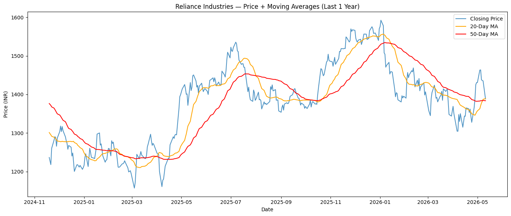
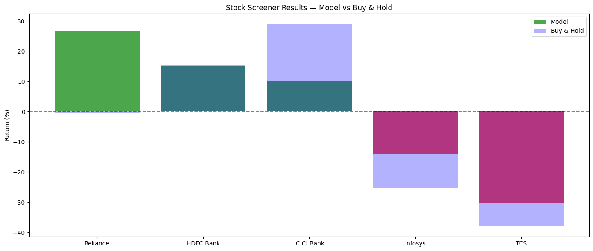

# 📈 Stock Predictor — ML Trading System

> An end-to-end machine learning trading system that predicts daily stock price direction (UP/DOWN) for Indian NSE stocks using XGBoost.


---

## 🌐 Live Demo

**Try the app live →** [https://rv-stock-predictor.streamlit.app](https://rv-stock-predictor.streamlit.app/)

No setup required — runs directly in your browser! 🚀

---


## 🎯 What This Does

This project predicts whether a stock will go UP or DOWN tomorrow using historical price patterns, technical indicators, and machine learning. It includes a full backtesting engine to test profitability on historical data.

## 📊 Sample Output

### Price Analysis with Moving Averages


### Multi-Stock Screener Results


---

## 🚀 Features

- ✅ **Real-time data** — pulls latest NSE prices via Yahoo Finance
- ✅ **9 technical indicators** — RSI, Bollinger Bands, Moving Averages, Volume changes, Price ratios
- ✅ **XGBoost ML model** — industry-standard gradient boosting
- ✅ **Time-based train/test split** — no future data leakage
- ✅ **Full backtesting engine** — simulates real trades with stop loss
- ✅ **Multi-stock screener** — tests strategy across 5 major NSE stocks
- ✅ **Buy & Hold benchmark** — compares strategy vs simple buying
- ✅ **Daily prediction report** — shows tomorrow's signals

---

## 📈 Results

Tested on 5 major NSE stocks (Reliance, TCS, Infosys, HDFC Bank, ICICI Bank):

| Metric | Value |
|---|---|
| Stocks Tested | 5 |
| Stocks Beat Market | 4/5 |
| Best Performer | ICICI Bank (+36.4%) |
| Average Accuracy | ~52% |

---

## 🛠️ Tech Stack

- **Python 3.11**
- **pandas, numpy** — data manipulation
- **yfinance** — stock data API
- **scikit-learn** — ML utilities
- **XGBoost** — gradient boosting classifier
- **matplotlib** — visualization

---

## 🚀 How to Run

1. Clone the repository:
```bash
git clone https://github.com/RishitVats2000/stock-predictor.git
cd stock-predictor
```

2. Install dependencies:
```bash
pip install -r requirements.txt
```

3. Run the screener:
```bash
python test.py
```

4. Generate the report:
```bash
python report.py
```

---

## 📁 Project Structure